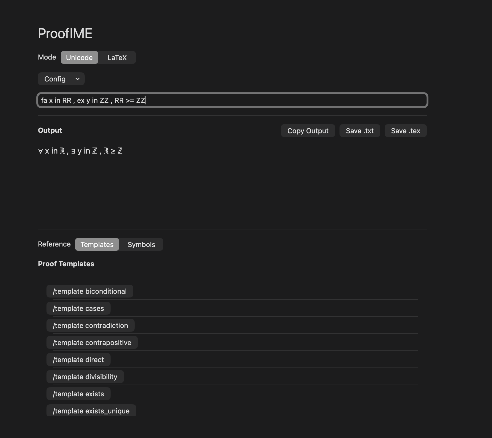
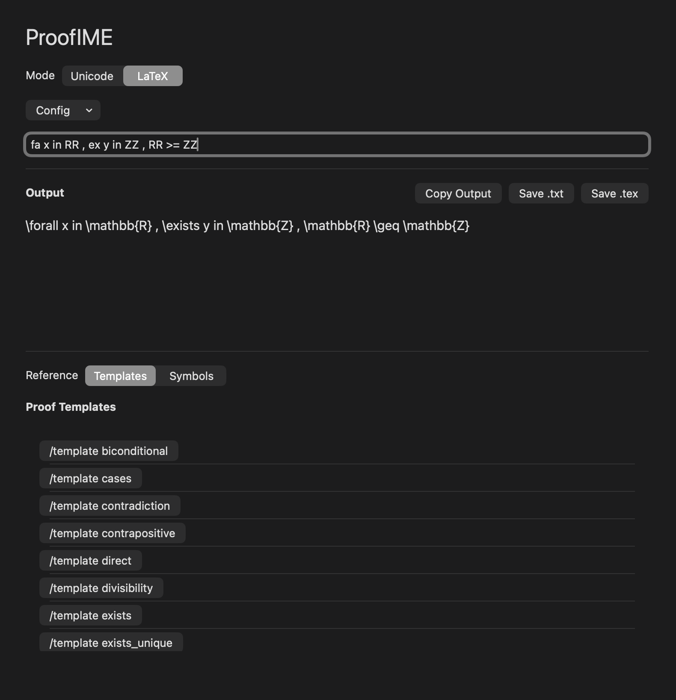
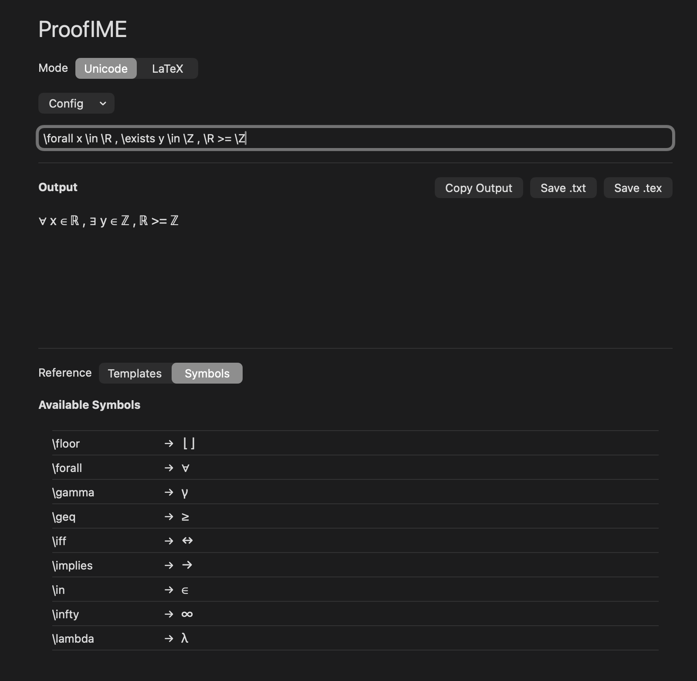
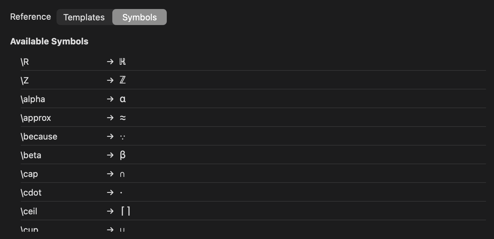

# ProofIME

ProofIME is an experimental macOS proof-writing tool inspired by Vietnamese Telex. It expands short, exact tokens into mathematical symbols or reusable proof text inside a reference SwiftUI application.

> ProofIME is currently a standalone application, not a macOS input method. It does not yet provide system-wide typing in editors or browsers.

## Current status

### Implemented

- A SwiftUI reference and testing interface with an AppKit-backed editor.
- Boundary-triggered replacement on Space, Tab, and Return in that editor.
- Built-in Unicode mappings loaded from `symbols.json`.
- A separate, built-in LaTeX mapping table for whole-text preview conversion.
- Legacy dictionary and rule-array symbol file decoding.
- Built-in proof templates, search, favorites, and insertion at the cursor.
- Symbol search and insertion, output copy, and `.txt`/`.tex` export.
- Import, reload, and deletion controls for a user `symbols.json`.

### In progress

- Consolidating tokenization and replacement semantics across the preview and live editor.
- Making configuration behavior consistent, validated, and test-covered.
- Expanding automated coverage beyond the initial live-replacement test.

### Planned

- A real InputMethodKit input method and system-wide integration.
- Candidate window and preferences UI.
- Proof-aware completions and context-aware theorem/proof templates.
- Compatibility testing in host applications. No support for VS Code, Pages, Notes, Safari, Obsidian, or other third-party apps is currently claimed.

See [ROADMAP.md](ROADMAP.md) and [PRODUCT_VISION.md](PRODUCT_VISION.md) for intended sequencing and scope.

## Example

Given the built-in mappings:

```text
fa x inn RR => ex y inn ZZ
```

The output preview is:

```text
∀ x ∈ ℝ ⇒ ∃ y ∈ ℤ
```

In LaTeX mode it is:

```latex
\forall x \in \mathbb{R} \Rightarrow \exists y \in \mathbb{Z}
```

In the editor, typing `fa` followed by Space produces `∀ `. Template triggers work at the same boundaries; for example, `contra` followed by Space inserts the built-in contrapositive template.

## Build and run

Requirements are determined by the Xcode project:

- macOS deployment target 26.3 for the application.
- Xcode capable of opening project object version 77 (the project records Xcode 26.4.1).
- Swift 5 language mode.

Open `ProofIME.xcodeproj`, select the `ProofIME` scheme, and run the macOS app. Command-line build:

```sh
xcodebuild -project ProofIME.xcodeproj \
  -scheme ProofIME \
  -destination 'platform=macOS' \
  -derivedDataPath /tmp/ProofIME-DerivedData \
  build
```

See [TESTING.md](TESTING.md) before relying on the current test suite.

## Configuration

The app uses `~/Library/Application Support/ProofIME/` and prefers a user `symbols.json` there when present. The Config menu can import a JSON file by copying it to that location. It does not validate the file before copying it; decode failures currently result in no mappings and a console message.

Two symbol formats are accepted. The built-in file uses a dictionary:

```json
{
  "fa": "∀",
  "inn": "∈"
}
```

A rule array is also decoded by the rule loader. See [SYMBOL_SPEC.md](SYMBOL_SPEC.md) for its schema and current semantic limitations.

Templates are bundled in `ProofIME/Resources/proof_templates.json`. Although the app defines a user template path and a delete action, template loading currently reads only the bundle. See [TEMPLATE_SPEC.md](TEMPLATE_SPEC.md).

## Documentation map

- [ARCHITECTURE.md](ARCHITECTURE.md): components, data flow, and technical boundaries.
- [IME_SPEC.md](IME_SPEC.md): proposed system input method contract.
- [SYMBOL_SPEC.md](SYMBOL_SPEC.md): symbol configuration formats and behavior.
- [TEMPLATE_SPEC.md](TEMPLATE_SPEC.md): proof template schema and behavior.
- [CONTRIBUTING.md](CONTRIBUTING.md): contribution workflow and code expectations.
- [CHANGELOG.md](CHANGELOG.md): repository history by tagged milestone.
- [`docs/adr`](docs/adr): architecture decisions and proposals.

## Screenshots

| Built-in Unicode | Built-in LaTeX |
|---|---|
|  |  |

| Custom configuration | Custom symbol library |
|---|---|
|  |  |

## Author

Trang Nguyen, Computer Science + Mathematics, Georgia State University
